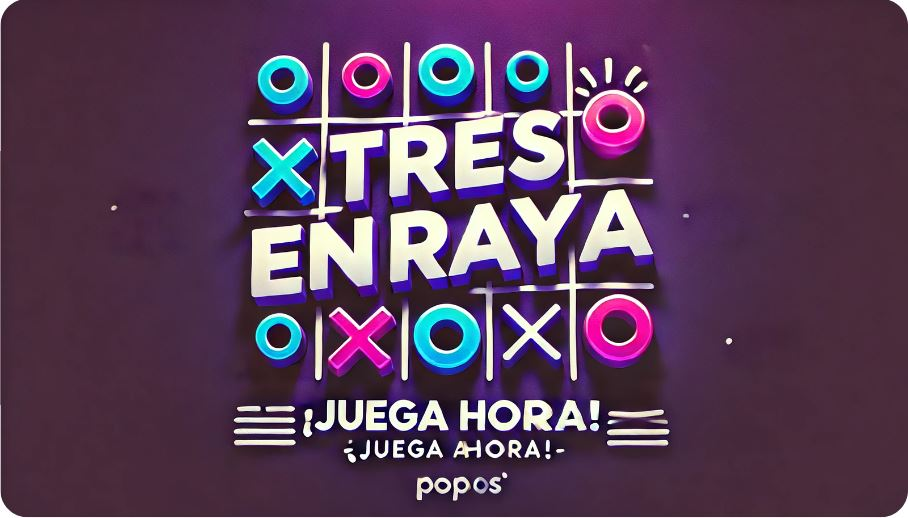
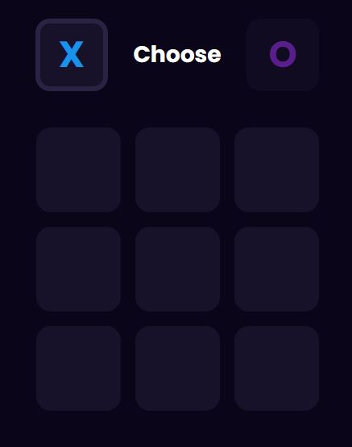

# 🎮 Tres en Raya (Tic-Tac-Toe)



Un sencillo juego de "Tres en Raya" (o Tic-Tac-Toe) desarrollado en HTML, CSS y JavaScript. Este proyecto permite jugar una partida de Tres en Raya entre dos jugadores, utilizando una interfaz web intuitiva y minimalista.

## 📑 Tabla de Contenidos
- [📋 Descripción](#-descripción)
- [⚙️ Instalación](#-instalación)
- [🚀 Uso](#-uso)
- [📸 Capturas de Pantalla](#-capturas-de-pantalla)
- [🛠️ Tecnologías Utilizadas](#-tecnologías-utilizadas)
- [📂 Estructura del Proyecto](#-estructura-del-proyecto)
- [👤 Autor](#-autor)

---

## 📋 Descripción
Este proyecto es una versión web de un clásico juego de mesa, donde dos jugadores compiten para completar una fila, columna o diagonal con sus símbolos ("X" o "O") en una cuadrícula de 3x3. Incluye una interfaz de usuario sencilla con indicadores para cada jugador y una opción de reinicio al finalizar cada partida.


## ⚙️ Instalación
Para ejecutar este proyecto en tu máquina local, sigue estos pasos:

1. **Clona el repositorio**:
    ```bash
    git clone <URL-del-repositorio>
    ```
2. **Navega al directorio** del proyecto:
    ```bash
    cd tres-en-raya
    ```
3. **Abre el archivo `index.html`** en tu navegador favorito.

Este juego no requiere instalación de dependencias adicionales, ya que está construido completamente en HTML, CSS y JavaScript puro.

## 🚀 Uso
1. Abre el archivo `index.html` en tu navegador.
2. Al iniciar, selecciona el símbolo con el que deseas jugar ("X" o "O").
3. Cada jugador selecciona una celda en la cuadrícula para colocar su símbolo.
4. El juego verifica automáticamente las condiciones de victoria.
5. Puedes reiniciar la partida en cualquier momento usando el botón de reinicio.

## 📸 Capturas de Pantalla


## 🛠️ Tecnologías Utilizadas
- **HTML5**: Estructura y contenido del juego.
- **CSS3**: Estilos para la interfaz, usando una combinación de diseño oscuro y fuentes modernas.
- **JavaScript**: Lógica de juego, gestión de turnos, detección de condiciones de victoria y reinicio de la partida.

## 📂 Estructura del Proyecto
La estructura de archivos del proyecto es la siguiente:

| Archivo       | Descripción                               |
|---------------|-------------------------------------------|
| `index.html`  | Estructura HTML del juego                 |
| `style.css`   | Estilos CSS para el diseño y apariencia   |
| `script.js`   | Lógica de juego en JavaScript             |


### 📄 Descripción de Archivos
- **index.html**: Contiene la estructura básica y los elementos de la interfaz, como el selector de jugadores y el tablero de juego.
- **style.css**: Define el esquema de colores, tipografía y diseño responsivo del juego. Usa una paleta de colores oscuros y la fuente "Poppins" para un estilo moderno.
- **script.js**: Incluye la lógica para gestionar los turnos de los jugadores, las condiciones de victoria y la funcionalidad de reinicio del juego.

## 👤 Autor
Este juego fue desarrollado como un proyecto de práctica en HTML, CSS y JavaScript. Ideal para quienes deseen explorar la creación de juegos web simples y entender cómo manejar la lógica básica en JavaScript.

---

¡🎉 Disfruta jugando y mejorando tus habilidades de programación con este proyecto de Tres en Raya! 🎉

